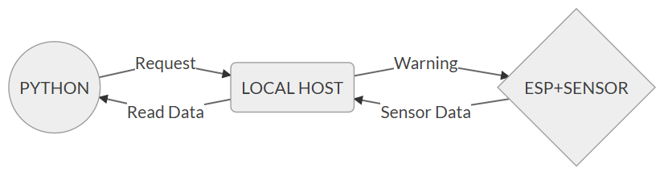

# ESP8266 to PY
It helps you to pull data from esp8266 and command it trough py. [Tutorial here.](https://www.instructables.com/id/ESP8266-and-Python-Communication-ForNoobs/) 

# Requirements
Python lib:
 - urllib.request *(generally internal lib)*

Arduino lib:
- [esp8266 card library](https://arduino-esp8266.readthedocs.io/en/2.4.1/installing.html) 

## System diagram
  
[Different visual version if you didn't understand.](diagram2.png)

# How to use this micro lib
Just import `ESP_MICRO.h` and use send / control / return functions for your project.

## start( ssid, pass)
You simply enter your wifi details into this function and it starts the connection.

## waitUntilNewReq( )
It's just a time block that waits for a request. It gives you the full control over python. With this ESP will wait until a python request come.

## returnThisStr(  )   & returnThisInt( )
Finally, you can return the desired data (or simply sensor data) to localhost server.

## getPath()
In order to command ESP trough py we also have a string returning function `getPath()`, it simply reads get request:
Useful with interacting and controlling the system.

`py: GET example.com/OPEN_LED 
esp:
    if (getPath()=="/OPEN_LED"){
    digitalWrite(LED,HIGH);
    }
`

# Important (Getting ESP's IP adress)
While uploading the code, check serial port for ESP's local IP if you don't know how to use nmap or obtain ESP's IP, it'll be printed.

# Reminder
 - It's fork of [mDNSserver example](https://github.com/esp8266/Arduino/tree/master/libraries/ESP8266mDNS) by [Ivan Grokhotkov](https://github.com/igrr) 

### Deficiencies
 - ~~The code is a bit complex, will be simplified.~~
 - ~~Needs a tutorial ~~ [(Tutorial here)](https://www.instructables.com/id/ESP8266-and-Python-Communication-ForNoobs/)
